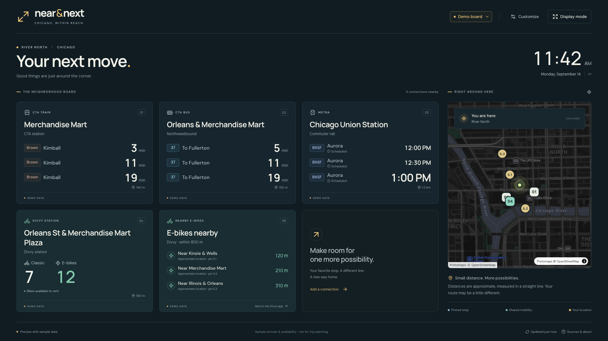

# Near & Next

An account-free Chicago neighborhood mobility board for a lobby, kitchen, or spare screen. Built with React, TypeScript, Protomaps/MapLibre, and a small Rust/Axum service.

**MVP:** local configuration, nearby stop discovery, transit arrivals, Divvy station availability and nearby e-bikes, shareable display links, and fullscreen display mode. The first launch is an explicitly labeled demo. Live mode never substitutes sample arrivals for unavailable data.



## Run locally

Requires Node.js 22.12+ and stable Rust (1.94+ recommended).

```sh
npm ci
cp .env.example .env.local
# Set VITE_PROTOMAPS_API_KEY in .env.local, then:
npm run dev
```

Open [localhost:5173](http://localhost:5173). Demo mode works without a backend; mapping requires a Protomaps key or a compatible custom style URL. Settings, display mode, import/export, and shared links work in the demo.

For live data, start the backend in another terminal:

```sh
cp server/.env.example server/.env
# Configure provider credentials and enable permitted feeds in server/.env.
npm run dev:server
```

Select **Live board** in the header. Use **Customize** to choose from the live catalog. The backend starts with no paid provider requests enabled. See [server setup and provider configuration](server/README.md).

## What works

- Pin separate CTA bus stops, CTA stations, Metra places, and Divvy stations. Filter routes/destinations and choose one to five arrivals.
- Find places around a fixed Chicago entrance using a keyboard-accessible list and a Protomaps map. Use GPS only on request, edit coordinates, or submit an address when Geocodio is configured.
- Recompute nearby Divvy e-bike/scooter search rules from fresh available vehicles. Scooter results require positively classified vehicles in the enabled feed; this is not a promise of citywide scooter coverage.
- Keep observed zero, unknown, closed, stale, missing, and disconnected states distinct. No indefinite “Due” predictions and no offline vehicle inventory presented as current.
- Save in this browser, import/export JSON, or copy an independent display link. Shared links omit the private display label and preserve the selected data mode.
- Dark/light themes, adjustable text, 12/24-hour Chicago time, landscape/portrait layouts, card pagination, fullscreen and best-effort wake lock.
- Cache the production application shell for offline reload. Live feed responses and map tiles are not stored by the service worker.

## Provider status

| Source | MVP support | Required setup |
| --- | --- | --- |
| CTA Bus Tracker | Native arrivals adapter, shared collector, current stop catalog | Server API key; authenticated deployment verification |
| CTA Train Tracker | Native arrivals adapter preserving schedule/delay/approaching flags | Separate server API key; authenticated deployment verification |
| Divvy GBFS 2.x | Station information/status, type classification, eligible free vehicles | Explicit feed enablement after reviewing applicable live-data terms |
| Metra | Places and a clear pending connection state | Realtime/static schedule joins are not implemented in this MVP |
| Lime / other scooter operators | Disabled | Provider eligibility, terms, and adapter validation |
| Geocodio | Submitted address candidates | Server API key; no autocomplete |
| Protomaps | Hosted vector basemap rendered with MapLibre | Public browser key with origin restrictions |

Demo schedules are illustrative. The app does not fabricate Metra scheduled service in live mode. GTFS timetable/calendar ingestion, alerts ingestion, a multi-day kiosk soak, production quota approval, and a 1,000-display load test remain future work. This repository does not claim those production acceptance gates have passed.

## Privacy and secrets

Board configuration is stored locally. There is no user account, hosted board database, or analytics. A display link includes coordinates and selected stops; anyone with it can learn the board location. Encoding is not encryption. Export files include the local label; links omit it. Opening a link imports an independent local copy, then removes the fragment from the address bar so later edits survive reload.

Fixed-stop queries send selections; an origin is sent to the server only for nearby vehicle rules. Address search sends the submitted text to the configured geocoder only when submitted. Map tiles reveal the viewed area to the tile provider.

Never commit `.env`, `.env.local`, provider keys, raw location histories, or credential-bearing logs. The checked-in environment files contain placeholders. `VITE_*` values are public in the browser bundle; a Protomaps browser key is expected to be public and should be restricted to your allowed origins. CTA and Geocodio keys stay in the Rust process.

## Development and checks

```sh
npm run build
npm test
npx playwright install chromium
npm run test:e2e
npm run test:offline
cargo fmt --manifest-path server/Cargo.toml --check
cargo clippy --manifest-path server/Cargo.toml --all-targets -- -D warnings
cargo test --manifest-path server/Cargo.toml
```

The browser tests exercise the UI with deterministic data and provider failures. They do not load-test upstream providers. See [test coverage](tests/README.md), [contributing](CONTRIBUTING.md), and [security](SECURITY.md).

## Architecture

```text
CTA / Divvy → shared Rust collectors → bounded normalized snapshots
                                           ↓
Browser configuration → same-origin /api/v1/board/query → cards + map
```

Frontend files are in `src/`, the Rust API and catalog importer in `server/`, and tests in `tests/`. `/api/v1` is versioned separately from configuration version 1. [The API contract](docs/implementation-contract.md) describes the types. [The original proposed specification](docs/product-spec.md) includes later production ambitions; it is not a claim of implemented features.

For a production build, run `npm run build` and `cargo build --release --manifest-path server/Cargo.toml`. Serve the frontend and `/api` under one HTTPS origin; the Rust process can optionally serve `dist` using `STATIC_DIR`. Keep `index.html` and `sw.js` revalidating and give hashed assets long cache lifetimes. Use one collector process and a supervisor with restart backoff. The MVP uses conservative active-stop limits and a delayed start; persistent quota accounting is a later capacity gate. Review [the backend README](server/README.md) before enabling providers.

## License and attribution

Source code is [MIT licensed](LICENSE). Provider data, map tiles, fonts, and library dependencies retain their respective licenses. See [data and map sources](docs/data-sources.md). Near & Next is not affiliated with or endorsed by CTA, Metra, Divvy/Lyft, Protomaps, or the City of Chicago.
