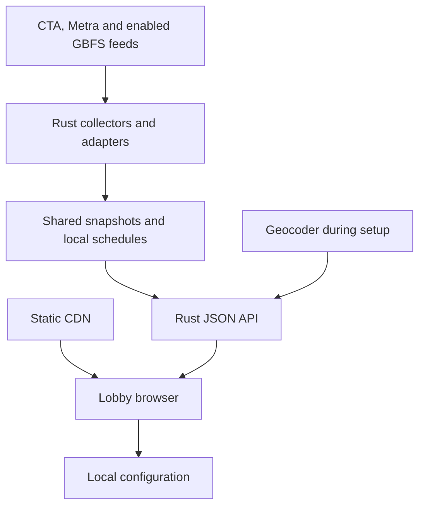

# Chicago mobility display proposed specification

Research date: 14 September 2026  
Status: Proposed architecture and product contract for implementation

## Recommendation

Build a static TypeScript frontend and one small Rust service that fetches, normalizes, and caches mobility data for every display. Use React with Vite in the browser and Axum with Tokio on the server. Keep board configuration in the browser, with an export file and a copyable configuration link. An account database is unnecessary for the first version.

The project is feasible, with provider access gates. CTA buses and trains have documented prediction APIs. Metra provides static schedules and a newer authenticated realtime API. Divvy publishes GBFS discovery with station and individual vehicle feeds. Lime is a conditional integration because its public feed terms restrict display and aggregation. Full coverage of every scooter operator should not be a launch promise.

Rust is a reasonable choice for a small, continuously running service. The larger cost savings come from sharing upstream requests across screens, sending small responses, and avoiding continuous geocoding, a hosted user database, and unnecessary infrastructure. A Rust backend works with any frontend that speaks HTTPS and JSON. A Rust browser frontend is optional and offers no inherent server cost advantage over a static TypeScript application.

All intervals, radii, limits, performance budgets, and product behavior below are proposed defaults unless specifically attributed to a provider. This is a specification, not a completed integration or a measured hosting benchmark.

## Feed review and readiness

GTFS Schedule is a downloadable timetable and location dataset. GTFS Realtime adds updates to trips and stops. GBFS describes current shared mobility stations and vehicles. CTA's own prediction APIs require separate adapters; one universal transit endpoint will not cover this app.

| Requirement | Proposed source | Evidence and readiness | Implementation consequence |
| --- | --- | --- | --- |
| Nearby CTA bus stops and upcoming service | CTA GTFS for locations and schedules; Bus Tracker v3 for predictions | Official documentation reviewed; developer account and API key required; authenticated responses not tested | Select actual stops and directions, then share batched prediction requests |
| Nearby CTA rail station and upcoming service | CTA GTFS plus Train Tracker arrivals API | Official documentation reviewed; separate key required; authenticated responses not tested | Retain station and platform IDs, destinations, and schedule versus prediction flags |
| Nearby Metra station and upcoming service | Metra GTFS Schedule plus GTFS Realtime TripUpdates and Alerts | Current official search-index excerpts reviewed; full developer pages returned access errors; no key or payload validation | Validate current access and static/realtime joins before enabling live Metra |
| Nearby Divvy station and bikes available | Divvy GBFS station information, station status, and vehicle types | Public v2.3 discovery JSON retrieved; child feed payloads not successfully inspected | Distinguish bike types and scooters; preserve zero, unknown, and station closure |
| Nearby undocked Divvy vehicles | Divvy GBFS individual vehicle feed and vehicle types | Discovery advertises `free_bike_status`; actual vehicle coverage remains an integration test | Save a search rule, not a particular vehicle; show only fresh, available, positively classified vehicles |
| Nearby Lime scooters | Lime Chicago GBFS | Endpoint listed in GBFS registry; payload not validated; terms require a separate eligibility check | Disabled until public-display and aggregation rights, access, and payload quality are confirmed |
| Other scooters | Operator-specific GBFS adapters | Spin Chicago appears in the registry, but this alone does not establish current service | Enable providers through a reviewed registry; do not infer current operators from older permit announcements |

These are distinct evidence levels: documentation establishes the intended interface; discovery establishes advertised child feeds; only representative payload tests establish operational coverage. Neither an HTTP access failure during research nor an empty vehicle list proves an operator has no service.

### CTA buses

Use the [CTA Bus Tracker developer page](https://www.transitchicago.com/developers/bustracker/) and its linked v3 reference. The official page states a default 100,000 transactions per day, updates about every 30 seconds, and roughly a half-hour prediction horizon. The developer obtains the account and key; households and businesses using the finished app do not need provider accounts.

The planned endpoint is `https://www.ctabustracker.com/bustime/api/v3/getpredictions`, with a server-held key, stop IDs, and JSON output. The [v3 guide dated 21 April 2025](https://www.transitchicago.com/assets/1/6/cta_Bus_Tracker_API_Developer_Guide_and_Documentation_2025-04-21.pdf) supports up to ten stop IDs per prediction request. Omit the global `top` cap for shared batches and select each service's next events after normalization. Preserve `typ=A` for arrivals and `typ=D` for departures. Prefer `unixTime=true`, noting that its epoch values are milliseconds, not seconds. Confirm actual batching, response limits, and ID mapping with authenticated fixtures.

Bus Tracker estimates arrivals. Its absence of predictions can reflect a detour or communications problem, so display “No live predictions” rather than asserting that no bus will run. The board's bus heading should say “Next buses” or “Arrivals,” not misrepresent arrivals as confirmed departures.

### CTA trains

Use `https://lapi.transitchicago.com/api/1.0/ttarrivals.aspx`, requesting JSON with a server-held key. The [reference](https://www.transitchicago.com/developers/ttdocs/) describes station batching inconsistently; verify HTTPS and requests for up to four station IDs with authenticated tests.

The [overview](https://www.transitchicago.com/developers/traintracker/) says 50,000 transactions per day; the [reference](https://www.transitchicago.com/developers/ttdocs/) says 100,000. Budget against 50,000 until CTA confirms the issued key's allowance.

The pages also differ on prediction horizon. Terminal times are schedule-based, so three live predictions will not always exist. Preserve `isSch`, `isApp`, `isDly`, and `isFlt`: distinguish schedules, approaching trains, delays, and potentially infeasible scheduled times. A delayed train should show “Delayed” instead of an aging countdown. Use tested platform/destination mappings for direction filters; `trDr` can change before the predicted Loop stop. These flag semantics are detailed in the [reference appendices](https://www.transitchicago.com/developers/ttdocs/).

### CTA schedules alerts and usage terms

The [CTA GTFS page](https://www.transitchicago.com/developers/gtfs/) points to `https://www.transitchicago.com/downloads/sch_data/google_transit.zip`. The [official directory](https://www.transitchicago.com/downloads/sch_data/) listed a roughly 100 MB compressed archive during this review; ingestion can consume substantially more memory than serving predictions. Stream the import outside request handling. Validate retained selections when catalogs change because IDs can be reassigned; never silently retarget a saved board to a different stop.

Use the [Customer Alerts API](https://www.transitchicago.com/developers/alerts/) for route/station disruptions, with planned HTTPS endpoints `https://lapi.transitchicago.com/api/1.0/routes.aspx` and `https://lapi.transitchicago.com/api/1.0/alerts.aspx`, subject to integration verification. GTFS schedules alone do not cover every disruption.

[CTA's terms](https://www.transitchicago.com/developers/terms/) permit rider-oriented display and processing, including caching with reasonable freshness efforts. Do not imply endorsement or sell the data separately. Credit is optional under these terms; the proposed app should still provide descriptive attribution. Brand/logo use has separate conditions.

### Metra

Use the current [Metra developer page](https://metra.com/developers), [GTFS API documentation](https://metra.com/metra-gtfs-api), and [key request and license](https://metra.com/gtfs-realtime-api-key-request-license-agreement). Official indexed documentation identifies the new realtime host as `https://gtfspublic.metrarr.com`, with `/gtfs/public/tripupdates`, `/gtfs/public/alerts`, and `/gtfs/public/positions`. Prefer an Authorization bearer token over a query-string token. The old `gtfsapi.metrarail.com` service was announced as unavailable from 1 November 2025.

The documentation states a 30-second update cadence. Fetch TripUpdates for event times and Alerts for disruptions; vehicle positions alone do not provide departure predictions. Official indexed material identifies `https://schedules.metrarail.com/gtfs/schedule.zip` and publication marker `https://schedules.metrarail.com/gtfs/published.txt`; these downloads were not validated and must be confirmed during integration. Match the active static trip IDs to realtime data. The current quota remains unverified.

The license requires redistribution through the application's own host and a non-affiliation statement. This supports the proposed shared backend. Before integration, obtain the key and full current agreement, verify endpoints and quota, and capture representative weekday, weekend, terminal, cancellation, and missing-update payloads. If realtime is unavailable, Metra can still show valid GTFS times labeled “Scheduled.”

### Divvy and scooters

The [Divvy system-data page](https://divvybikes.com/system-data) links to its live feed. The retrieved [Divvy discovery feed](https://gbfs.divvybikes.com/gbfs/2.3/gbfs.json) reports GBFS 2.3 and advertises `station_information`, `station_status`, `free_bike_status`, `vehicle_types`, and other feeds on `gbfs.lyft.com`. Its discovery TTL was 60 seconds; that is not proof that each child feed has the same TTL. Follow discovery URLs and inspect each child's freshness metadata.

The [GBFS system registry](https://github.com/MobilityData/gbfs/blob/master/systems.csv) lists the following discovery endpoints. Registry entries identify candidates, not permission or guaranteed service:

| Provider | Discovery endpoint | Initial setting |
| --- | --- | --- |
| Divvy | `https://gbfs.divvybikes.com/gbfs/2.3/gbfs.json` | Enable after payload and terms validation |
| Lime Chicago | `https://data.lime.bike/api/partners/v2/gbfs/chicago/gbfs.json` | Disabled pending eligibility and integration validation |
| Spin Chicago | `https://mds.bird.co/gbfs/v2/public/provider/spin/chicago/gbfs.json` | Disabled pending evidence of current service and permitted use |

In GBFS 2.x, a field or feed with “bike” in its name can represent other vehicle types. Resolve types using `vehicle_types`, and map form factor and propulsion separately. Do not call a mixed vehicle total “bikes.” Support the published 2.x variants first; isolate parsing by version so GBFS 3.x's `vehicle_status` and changed fields can be added without changing the app's contract. See the [GBFS reference](https://gbfs.org/documentation/reference/).

The station card should default to “Bikes available,” split into classic and electric where supported. This answers whether someone can rent a bike. A physical count of everything docked, including disabled bikes, is a different metric and must only appear when the feed supports that count by type. Virtual stations must not be described as physical docks.

[Lime's Public GBFS Terms](https://www.li.me/legal/public-gbfs-terms) limit the basic license to internal noncommercial use, condition availability display on applicable local requirements, and restrict third-party aggregation subject to local-law exceptions. They also specify attribution, at least minute-by-minute refreshing, and a ten-minute data retention/display limit. Do not assume a publicly reachable JSON endpoint grants this app permission. Confirm Chicago eligibility or obtain provider permission before enabling Lime, and encode the applicable terms as adapter policy. A free display in a business is not automatically exempt.

Divvy's [published data license](https://divvybikes.com/data-license-agreement) permits incorporating data in products/services but imposes restrictions, including on standalone redistribution and brand use. Confirm the applicable live-feed license from system metadata and provider terms rather than assuming the historical-trip license covers every GBFS use. This app should return bounded board data, not offer a bulk citywide feed export.

The [Chicago scooter program page](https://www.chicago.gov/city/en/depts/cdot/supp_info/escooter-share-pilot-project.html) was indexed as listing Lime and Divvy; direct access failed during research. [Lime's Chicago page](https://www.li.me/locations/chicago) confirms its Chicago service. Verify the operator roster at launch instead of treating a historical multi-operator permit list as current.

Historical Divvy trip downloads and Chicago scooter trip datasets are not live inventories. Regulatory MDS feeds are not a substitute for authorized public availability feeds. Do not scrape consumer apps or use private rider APIs.

## Product behavior

### Setup without an account

1. Enter a Chicago address and submit it, choose “Use my location,” or place a map pin. Return address candidates when needed and ask the user to confirm the building entrance. Collect no apartment or household name unless voluntarily used as a local board label.
2. Show a map and an equivalent keyboard-accessible list. Search independently for bus stops, CTA stations, Metra stations, and Divvy stations. The nearest CTA station and nearest Metra station are separate suggestions.
3. Suggest bus stops within 800 meters, CTA stations within 1.6 kilometers, Metra stations within 5 kilometers, and Divvy stations within 800 meters. These are adjustable discovery radii. If a category has no result, offer to expand it explicitly.
4. Let users pin stops/stations, choose routes and directions or destinations, reorder cards, and set one to five upcoming events. Default to three per selected service/destination group. Never merge opposite-side bus stops just because their names match.
5. For undocked Divvy bikes and scooters, save operator, vehicle type, radius, and maximum count. Default to the closest three eligible vehicles within 800 meters for each selected category. Recompute this list on each fresh snapshot. Individual vehicle IDs are unsuitable as permanent favorites.
6. Preview landscape and portrait layouts. Configure text size, light/dark theme, compact map, display label, 12/24-hour time, and optional service alerts. Validate capacity and offer additional pages if the selected content will not fit legibly.
7. Save locally, export configuration, or copy the display link. Open the link on the lobby display's browser and enter fullscreen/kiosk mode.

“Nearest” initially means straight-line geographic distance, using WGS84 coordinates and an exact distance calculation after spatial candidate lookup. Label it approximate. Rivers, railways, highways, entrances, and accessible paths can change real walking distance. Allow manual station selection and an optional user-entered walk allowance; do not advertise an uncomputed walking route or subtract that allowance from the actual transit time.

A pinned Divvy station stays pinned when empty or temporarily unavailable. An optional “nearest station with bikes” card is a different, explicitly dynamic rule. Keep that distinction visible in setup.

### Lobby display

| Area | Content and behavior |
| --- | --- |
| Header | Optional generic label, Chicago local time, connection status |
| Transit cards | Stop/station, route or line, destination, upcoming times, live/scheduled indicators, relevant disruptions |
| Divvy station card | Name, approximate distance, available classic/electric bikes, separate scooters if published, rental availability |
| Individual vehicle cards | Provider, vehicle type, approximate distance, available location description, matching numbered map pin |
| Compact map | Nearby selected places and current eligible vehicles; preserve a fixed viewport to avoid distraction |
| Footer | Freshness indicators and required data/map attribution; optional mobile board link |

Use a stable grid, large high-contrast type, and no required scrolling. Target modern Chromium on a dedicated player at 1920×1080, 3840×2160, and 1080×1920; support smaller browsers for setup. Suggested 1080p sizes are 32–40 px for primary times and at least 24 px for essential labels, with user adjustment. Validate readability on an actual large screen several meters away.

Use route colors together with text, never color alone. Provide keyboard navigation, visible focus, reduced-motion behavior, and accessible form labels. Announce connection changes without making screen readers announce every countdown tick. Maps have an equivalent list.

Show relative minutes for near-term service and an absolute time for later service. Preserve provider “approaching” information; do not leave expired events at “Due” indefinitely. A schedule-only time is always marked “Scheduled.” Cancellation and skipped-stop information override an ordinary boarding prediction. A live ETA is an estimate, not a guarantee.

For scooters and undocked bikes, use feed-provided descriptions when available. Otherwise use a map pin and approximate distance/direction, with an optional label from a local street/intersection index. Do not turn an approximate reverse geocode into a claimed exact parking address. Renting and unlocking happen in the operator's app; validated operator links or QR codes can hand off to it.

### Empty and failure states

Distinguish “0 bikes available,” “No vehicles reported nearby,” “No live predictions,” “Scheduled service only,” “Station unavailable,” and “Feed unavailable.” A provider that is not connected must not appear to have zero vehicles. A failure in one source must leave the other cards usable.

When the network drops, keep the application shell and configuration. Mark any retained transit snapshot stale, then remove expired live estimates. Never display an offline vehicle inventory as current. On reconnect, recover automatically without erasing configuration.

## Frontend and Rust architecture

| Component | Proposed choice | Purpose |
| --- | --- | --- |
| UI | TypeScript, React, Vite, CSS grid | Static setup and display application; familiar browser ecosystem |
| Map | Lazy-loaded MapLibre GL JS with licensed tiles | Map only where useful; text display works if WebGL or tiles fail |
| API | Rust, Axum, Tokio | Async request handling and scheduled provider collection |
| Upstream client | Reused reqwest client | Connection pooling and explicit timeouts |
| Serialization | Serde and a versioned JSON/OpenAPI contract | Keep provider formats out of frontend code |
| Timetables and place index | Local SQLite plus versioned compact catalog files | Embedded storage; no database server required |
| Realtime state | Bounded in-memory snapshots and indexes | Latest useful state, shared by all screens |
| Deployment | Static CDN and one continuously running Rust process | Low component count; same public origin routes `/api` to Rust |

[Vite's production build](https://vite.dev/guide/build) produces deployable static assets. Node is a build tool here, not a production web server. [Axum](https://docs.rs/axum/latest/axum/) supplies HTTP routing and integrates with Tower middleware; [Tokio](https://tokio.rs/tokio/tutorial) supplies asynchronous execution. [MapLibre GL JS](https://maplibre.org/maplibre-gl-js/docs/) is a map renderer; its use does not supply a free, unrestricted tile service.

A Rust frontend such as [Leptos in client-side mode](https://book.leptos.dev/deployment/csr.html) is viable, but would add WebAssembly tooling and browser integration learning. Recommend TypeScript for this project. Changing the frontend language would not eliminate feed keys, upstream quotas, or the shared collector.

Avoid server-side rendering, WebSockets, a message broker, Kubernetes, Redis, and a hosted database in v1. None is needed to render cached data every few seconds. Consider added components only after measurement identifies a concrete bottleneck or availability requirement. One instance is an acknowledged single point of failure; process supervision, restart recovery, and honest offline states are part of the pilot.

## Normalized data contract

Publish `/api/v1` and version the board configuration independently. Use namespaced string IDs such as `cta:bus_stop:<source-id>` and retain source IDs as strings. Do not derive parent/child relationships from numeric prefixes. Store distances in meters and machine event timestamps in UTC RFC 3339; render in `America/Chicago`.

The following is the proposed contract, not a verbatim copy of any feed. Nullable means unknown or not supplied; zero always means an observed zero.

| Entity | Required contract fields | Rules |
| --- | --- | --- |
| Provider | `id`, `name`, `capabilities`, `connection_state`, `attribution`, `terms_url` | State is enabled, pending, unavailable, or disabled; capabilities explicitly identify supported data |
| Place | `id`, `provider_id`, `source_id`, `kind`, `name`, `lat`, `lon`, `parent_id?`, `platform_label?` | Kind distinguishes bus stop, rail station, platform, and shared station; include optional accessibility and entrance information |
| Service | `id`, `provider_id`, `route_id`, `mode`, `label`, `direction_id?`, `headsign?`, `color?` | Provider direction identifiers stay separate from a human destination label |
| TransitEvent | `id`, `place_id`, `service_id`, `trip_id?`, `service_date?`, `stop_sequence?`, `destination?`, `event_kind`, `scheduled_at?`, `expected_at?`, `time_basis`, `status`, `boardable`, `schedule_feasibility`, `freshness` | Trip destination overrides service default; event kind is arrival/departure; basis is prediction/schedule/unknown; status is normal/delayed/canceled/skipped/unknown; feasibility is unflagged/questionable/unknown |
| StationAvailability | `place_id`, `station_kind`, `rental_state`, `return_state`, `available_by_type[]`, `disabled_by_type?`, `docks_available?`, `freshness` | Station kind distinguishes physical docks, virtual station, and unknown; do not infer physical totals from rentable counts |
| VehicleType | `id`, `provider_id`, `source_type_id`, `form_factor`, `propulsion` | Bicycle, standing scooter, seated scooter, other, or unknown; human, electric assist, electric, other, or unknown propulsion |
| SharedVehicle | `id`, `provider_id`, `type_id`, `lat`, `lon`, `placement`, `station_id?`, `availability`, `location_label?`, `range_m?`, `rental_url?`, `freshness` | IDs are ephemeral; placement distinguishes free floating, stationed, and unknown; unsupported classifications stay unknown |
| Alert | `id`, `provider_id`, `affected_ids[]`, `severity`, `text`, `url?`, `active_from?`, `active_until?`, `freshness` | Sanitize text; scope to selected places/services; preserve closures and accessibility disruptions when supplied |
| Freshness | `source_observed_at?`, `feed_generated_at?`, `fetched_at`, `stale_at`, `expires_at`, `state` | Fetch success alone cannot reset an old source observation; state is fresh, stale, or unavailable |
| BoardResponse | `schema_version`, `server_time`, `next_poll_after_s`, `catalog_version`, `cards[]`, `providers[]`, `attributions[]` | Each card carries data or a typed error/empty state; partial success is normal |

Each `available_by_type` element contains `type_id` and `count`. Availability is an explicit enum (`available`, `unavailable`, `unknown`); source reservation and disability flags contribute to it. Show a free vehicle only when the published information establishes it is rentable, has valid coordinates, matches the rule, and has not expired. Provider metadata, source-station assignment, and version-specific placement rules must establish that it belongs in an undocked list. Do not double count station-associated vehicles in both an undocked list and station totals.

### Time and identity handling

For GTFS-derived events, identity includes provider, trip instance/service date, stop sequence, and event kind. Preserve platform/station relationships separately. CTA native events use the adapter's run/trip fields and service date where available; do not merge events solely by route and rounded minutes.

Honor GTFS service calendars and exceptions, after-midnight times above 24:00:00, pickup restrictions, and agency timezone. Query all relevant service dates around midnight. Treat daylight-saving transitions explicitly using a timezone-aware library and the GTFS service-day definition, rather than naive local midnight arithmetic. Frequency service with `exact_times=0` requires headway messaging, not invented exact scheduled departures. See [GTFS Schedule reference](https://gtfs.org/documentation/schedule/reference/).

Join realtime data to the active static feed. Prefer an explicit departure update for a departure card; if only arrival is available, retain that event kind. Apply published trip/stop delay and relationship rules, including canceled trips, skipped stops, and missing data. No realtime update means prediction unknown, not “on time.” Handle full snapshots as replacements so missing entities do not remain live indefinitely. See [GTFS Realtime reference](https://gtfs.org/documentation/realtime/reference/).

Group upcoming events by stop/platform, route, and trip-specific destination. Supplement CTA native events with static GTFS in one ordered list only when a reliable trip-instance mapping prevents duplicated or misordered live/scheduled entries. Without that mapping, show the native events as supplied and offer a separate labeled schedule section or mode. Never manufacture three distinct upcoming vehicles to fill a card.

## Account-free configuration and privacy

`BoardConfigV1` contains a schema version, optional display label, selected entrance coordinates, timezone, layout, ordered station/service selections, individual-vehicle search rules, and display preferences. It contains no provider key, password, or permanent vehicle ID.

Save configuration in `localStorage`. Provide “Export settings,” “Import settings,” “Copy display link,” and “Reset this device.” Store a bounded, encoded configuration in the URL fragment, for example `/display#v1=<encoded-config>`. Limit decoded data to 16 KiB and a small fixed number of cards; reject unsupported versions and invalid IDs. Keep a short-link-free export path for configurations too large for a practical QR code.

A link opens an independent copy. Updating the original browser does not update copies on other displays. Browser storage can be cleared and private-session storage is not durable, so recommend saving an export or display link. URL fragments do not travel in the initial HTTP request, but are readable by scripts and by anyone with the link. Encoding or compression is not encryption. See [localStorage](https://developer.mozilla.org/en-US/docs/Web/API/Window/localStorage) and [URI fragments](https://developer.mozilla.org/en-US/docs/Web/URI/Reference/Fragment).

Exclude the original address text and private label from exported links by default; disclose that coordinates and selected stops reveal the board's location. Do not use third-party analytics that capture full URLs or configuration. A visitor-facing QR should contain a deliberately public board copy. Local display mode is a convenience setting, not protection against somebody who controls the browser.

Request browser location only when the user clicks the location button. Show accuracy when available, permit manual correction, and save a fixed entrance after confirmation. Do not continuously track a stationary display. HTTPS and user permission are required by the [Geolocation API](https://developer.mozilla.org/en-US/docs/Web/API/Geolocation_API).

Remote configuration and automatic fleet-wide changes can be a later account-free feature using stored boards and separate unguessable view/edit capability tokens. That introduces persistence, recovery, abuse prevention, and token revocation; it is outside the initial implementation.

## API and discovery workflow

| Endpoint | Use | Cache and privacy behavior |
| --- | --- | --- |
| `GET /api/v1/capabilities` | Enabled providers, limits, attribution, supported config versions | Small cacheable public response |
| `GET /catalog/<version>/places.json` | Compact transit and shared-station metadata, relationships and service choices | Versioned static asset through CDN; browser finds nearby candidates |
| `POST /api/v1/geocode` | Submitted address to candidates | Setup only; key on server; bounded query; no request body logging |
| `POST /api/v1/board/query` | Validated station selections and optional shared-vehicle search area to aggregate cards | Response from shared data; `Cache-Control: no-store` for personalized response; no persisted board |
| `GET /health/live` | Process health | No credentials or internal feed details |
| `GET /health/ready` | Catalog and service readiness | Report readiness separately from temporary failure of an optional provider |

A board query contains the selected IDs and filters, not theme or household address. Fixed station predictions need no location. Shared vehicle queries can use coarse spatial cells covering the selected radius; return bounded candidates and perform final exact distance ranking in the browser. Ensure the cells include adjacent boundaries so the actual nearest vehicle is not missed. If cell coverage would exceed response limits, narrow the permitted rule or request a precise search origin with explicit handling; never silently truncate before nearest ranking.

The server validates catalog IDs, operator state, geographic limits, card count, and radius. Proposed caps: 12 cards, 20 bus stops, 8 rail stations, 10 fixed shared stations, three dynamic vehicle rules, and a 2-kilometer dynamic-vehicle radius. Discovery may offer a wider Metra search without causing citywide dynamic queries. These are API bounds, not a recommendation to fit every maximum on one screen.

Empty data, loading, upstream errors, stale snapshots, unsupported providers, and invalid selectors are typed outcomes. A single provider failure returns a partial board, not a blank page. API parsing must validate at runtime; TypeScript types alone do not validate external JSON.

Publish a new immutable catalog when relevant transit or GBFS place metadata changes. Advertise the current version in capabilities at startup and in board responses; browsers refresh metadata when that version changes. A formerly valid but removed selection produces “Choose a replacement stop/station” on that card and preserves the rest of the board. Distinguish obsolete selections from malformed IDs, and do not automatically substitute a nearby station without user confirmation.

## Polling caching and resource budget

Regional feeds are fetched once per active provider. CTA predictions are fetched for the union of recently requested stops, grouped into provider-supported batches. Normalization and indexing happen once per successful upstream response. Browser requests read snapshots; they do not each initiate provider requests.

| Work | Proposed cadence and policy |
| --- | --- |
| Display refresh | About every 30 seconds with jitter; countdowns update locally; follow server backoff hints |
| CTA bus and train predictions | About every 30 seconds for active stops, within approved quotas |
| Metra TripUpdates | At most once every 30 seconds; one shared regional fetch |
| Metra and CTA alerts | Start at 60 seconds where permitted; cache and scope locally |
| GBFS dynamic feeds | Follow each feed's TTL, permitted cadence, and freshness policy; start with 30–60 seconds where compatible |
| GBFS metadata | Follow its own TTL/cache headers; refresh discovery and resolve changes; do not assume metadata and status cadences match |
| GTFS schedules | Check for updates daily using conditional HTTP where supported; validate before atomically activating a new catalog |
| Address geocoding | Only during setup/editing; never on the board refresh loop |
| Active demand | Renew in memory when a board polls; retire unused stop interest after five minutes |

On a cold request, record bounded demand and return “Loading live data” plus any valid schedule. The scheduler performs one coordinated refresh. Combine duplicate in-flight work and avoid overlapping refreshes. On 429 or temporary failure, honor `Retry-After`, use bounded exponential backoff, and enforce provider-wide budgets. Apply fairness so many unusual stop selections cannot starve existing displays. Stop optional requests before exhausting quota; use labeled schedules when required.

Use conditional HTTP and caching headers where supported, but do not assume a 304 response is free against provider quotas. Persist small quota counters or restart conservatively so repeated process restarts cannot reset the effective daily budget. Provider reset times must be configured from confirmed rules, not assumed to be UTC.

Freshness uses source and record timestamps, not just fetch time. Initial policy: mark transit predictions stale after 90 seconds and suppress them after 180 seconds; hide individual vehicle availability after 120 seconds. Show a stale station count only as visibly old information until its configured expiry, then replace it with unavailable. These are product defaults to tune against observed feeds and provider terms, not guaranteed source publication rates. The [GTFS Realtime best practices](https://gtfs.org/documentation/realtime/realtime-best-practices/) recommend that trip updates and positions be no older than 90 seconds.

Every adapter must set explicit freshness and maximum retention limits; use the stricter applicable limit across source policy, response cache, server memory, and browser behavior. If a feed's TTL conflicts with the desired freshness target, adjust the target or decline live support rather than overpolling. Clients apply absolute expiry locally even while offline. Immutable place metadata can remain cached separately from live availability. Do not archive vehicle locations or movement history.

### Capacity model

For stop-specific feeds, the idealized daily fetch count is:

`ceil(unique_active_stops / supported_batch_size) × 86400 / refresh_seconds`

This assumes all selected stops fit valid batches, stable demand, and one refresh per batch; metadata, retries, alerts, and fragmentation consume additional quota.

| Example at a 30-second interval | Estimated daily provider fetches |
| --- | ---: |
| 100 unique bus stops, ten per batch | 28,800 |
| 300 unique bus stops, ten per batch | 86,400 |
| 40 unique CTA rail stations, four per batch | 28,800 |
| 64 unique CTA rail stations, four per batch | 46,080 |
| One regional realtime feed | 2,880 |

Three hundred bus stops leave little operational headroom under the published bus default. Sixty-four rail stations leave little headroom under the conservative 50,000 train budget. Target at most 70–80% of an approved quota for ordinary polling and reserve capacity for setup, retries, and other calls. Route/location APIs cannot simply replace station predictions: positions are not departure estimates.

One thousand displays polling every 30 seconds generate about 33.3 app requests per second and 2.88 million app requests daily. With an assumed average 10 kB compressed board response, that is about 28.8 GB/day of response payload, excluding headers, maps, assets, and retransmissions. These are illustrative calculations, not measured payloads or a price quote. Shared fetches prevent this display traffic from multiplying upstream traffic; egress can still dominate cost.

Start by benchmarking one small always-on instance with one shared collector owner. A candidate test allocation is one virtual CPU and 512 MiB–1 GiB RAM; select actual capacity after measuring active catalogs, import peaks, response sizes, and concurrency. Do not promise this footprint before profiling. When scaling to multiple instances, establish one collector owner or a shared snapshot distribution mechanism so autoscaling does not multiply provider polling.

## Geocoding and map services

Propose Geocodio for submitted Chicago address lookup through the Rust adapter, with candidate confirmation and manual pin placement. Its [API documentation](https://www.geocod.io/docs/) supports address geocoding, and its [API overview](https://www.geocod.io/api) describes storage and reuse of forward-geocoding results. Confirm the chosen plan and [terms](https://www.geocod.io/terms-of-use) during integration. End users need no Geocodio account. Show that address search sends the submitted address to a geocoding provider; GPS/manual-pin setup avoids that request.

Autocomplete is not required for v1 and can introduce unnecessary calls. Do not use the public Nominatim endpoint as the default: its [public-service policy](https://operations.osmfoundation.org/policies/nominatim/) limits aggregate application traffic to one request per second, forbids autocomplete, and imposes additional conditions on generated applications. Self-hosting a geocoder would work against the initial resource goal.

Use a licensed tile plan whose terms permit this commercial/public-display usage, or a separately licensed static Chicago tile package hosted through a CDN. Keep the map provider configurable and preserve attribution. Do not rely on OpenStreetMap's public tile servers as unrestricted production infrastructure; their [tile usage policy](https://operations.osmfoundation.org/policies/tiles/) has caching, attribution, and prefetch restrictions. Obtain tiles from an authorized source, not by bulk downloading that public service.

Keep a stationary map's viewport and basemap stable; update only markers. Lazy-load the map in setup and make it optional in display mode. Avoid reverse-geocoding every vehicle on every poll. Geocoding calls, map loads, and API egress need separate usage budgets even if the Rust CPU bill is small.

## Rust engineering and operational requirements

Use stable Rust with an explicit toolchain and committed dependency lockfile. Organize a small workspace around domain types, provider adapters, collection/cache logic, HTTP API, and a catalog-import command. Generate OpenAPI and TypeScript client types from one reviewed contract, and check compatibility in CI. Run formatting, Clippy, meaningful tests, frontend type checks, and dependency vulnerability/license auditing. The frontend never parses native CTA, GTFS, or GBFS formats.

Reuse one configured [reqwest Client](https://docs.rs/reqwest/latest/reqwest/struct.Client.html) per appropriate transport policy. Set connection and total deadlines, body-size limits, bounded concurrency, and descriptive user-agent identification. Use immutable snapshots behind shared references; replace only after parsing and validation succeed. Keep lock scopes short and never hold a synchronous lock across an awaited network call; see [Tokio shared-state guidance](https://tokio.rs/tokio/tutorial/shared-state).

Run blocking SQLite work and CPU-heavy GTFS import away from async request workers. Stream ZIP/CSV input where practical, limit decompression sizes, build a new indexed catalog, validate joins and service dates, then atomically switch versions. Preserve the last valid catalog after a failed import and stop presenting schedules outside their known validity. Feed-supplied links and strings are untrusted input.

Keep secrets in the server's secret/environment facility. Values exposed through frontend build variables are public; [Vite explicitly documents this](https://vite.dev/guide/env-and-mode). Redact query-string provider keys from logs and tracing. Fixed endpoint allowlists, constrained discovery redirects, HTTPS, same-origin routing, security headers, input limits, escaped output, and rate limiting are baseline protections. CORS alone does not prevent API abuse. Public board users should not be able to turn the service into an arbitrary URL proxy.

Measure source age, upstream successes/failures, daily quota use, parse failures, cache hit rate, active stop count, API latency, memory, CPU, and bytes per display. Do not log exact address search bodies, full board configuration, or vehicle histories. Use coarse aggregate operational metrics and a short documented retention policy for logs. Add a per-provider disable switch.

Deploy a release binary in a small non-root image or supervised service, with graceful shutdown, explicit resource limits, health checks, and restart backoff. Build outside the production instance. Keep static app assets independently cacheable and roll updates safely so an unattended browser recovers without a mixed asset version.

Fullscreen and browser wake lock are conveniences; they do not replace device kiosk configuration and power management. Wake lock can be denied or released, so handle reacquisition and screen visibility changes. See the [Screen Wake Lock API](https://developer.mozilla.org/en-US/docs/Web/API/Screen_Wake_Lock_API).

## Delivery phases and acceptance criteria

| Phase | Deliverable | Exit condition |
| --- | --- | --- |
| 1 Feed validation | Credentials, current terms/attribution record, representative fixtures, provider ID mappings, measured feed cadence and sizes | CTA and Metra auth work; Divvy station/type/vehicle coverage is understood; Lime has a clear enabled/disabled decision; quotas confirmed or conservatively capped |
| 2 Vertical slice | One address/GPS selection, one bus stop, one CTA station, one Metra station, one Divvy station, dynamic Divvy vehicles, saved board | End-to-end live or explicitly scheduled cards; reload and export/import preserve selections |
| 3 Lobby pilot | Multi-card setup, map/list views, large-screen layouts, alerts, stale/error recovery, operator adapters allowed by phase 1 | Representative lobby locations run unattended; feed failures never look like fresh zero availability |
| 4 Capacity and release | Load profile, quota headroom, dependency/security checks, deployment and recovery procedure | Agreed screen count fits measured CPU/RAM/egress and upstream budgets; attribution and operational gates complete |

The complete five-category product requires an authorized scooter feed with actual coverage. A narrower transit-and-Divvy pilot is useful, but must state which scooter operators are supported and must not be described as complete citywide scooter coverage.

Required behavior tests should exercise real failure modes: Chicago daylight-saving changes, service after midnight, holiday calendars, expired schedules, canceled trips, skipped stops, repeated stops on a trip, missing realtime updates, invalid source timestamps, mixed station vehicle types, reserved/disabled vehicles, missing type definitions, disappearing vehicle IDs, malformed payloads, rate limits, and partial provider outages. Preserve unknown values rather than coercing them to zero.

Product checks: denied/approximate GPS, ambiguous address, keyboard-only setup, out-of-area pin, opposite-side bus stops, separate CTA/Metra choices, empty pinned stations, invalid/older configuration imports, storage loss recovery, map failure, offline/reconnect, and 1080p/4K/portrait legibility. Run a multi-day kiosk soak and a representative 1,000-display load test before claiming that scale. Replaying allowed fixtures is preferable to load-testing provider APIs.

Suggested internal performance targets: cached board API p95 below 200 ms at the agreed load, no upstream request multiplication when displays share stops, predictable bounded memory after a multi-day soak, and ordinary polling below 80% of each approved quota. Source freshness is a separately monitored dependency, not a guarantee the app can manufacture.

## Existing product reference

CTA already provides an [account-free DIY Transit Info Display](https://www.transitchicago.com/developers/diydisplay/) for bus and train information. Review it for useful lobby setup conventions and provider presentation expectations. The proposed product adds Metra, shared bikes, individual vehicles, and unified selection/configuration; assess those differences during the pilot.

## Decisions to carry into implementation

Adopt Rust/Axum/Tokio plus a static React/TypeScript/Vite frontend. Start with a single shared collector, local schedules, in-memory live data, browser-owned configuration, and setup-only address lookup. Implement CTA, Metra, and Divvy behind the same domain contract. Make Lime and other operators explicit provider gates.

Before production, resolve the CTA train quota conflict, validate Metra's current authenticated interface and schedule join, inspect Divvy's child feeds and license, confirm scooter display rights and current service, select a map plan, and measure the resource budget. These tasks require provider credentials or commercial decisions during implementation; they do not require accounts for people configuring lobby displays.
